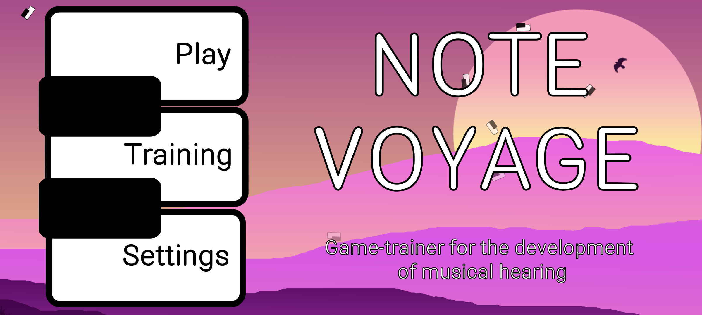
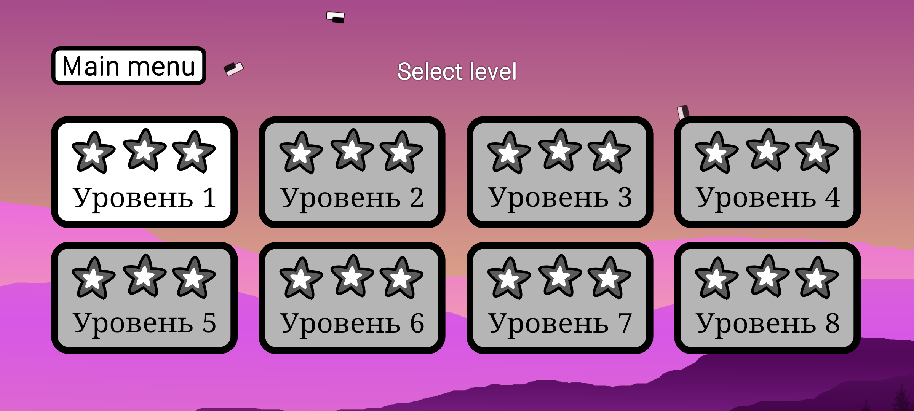
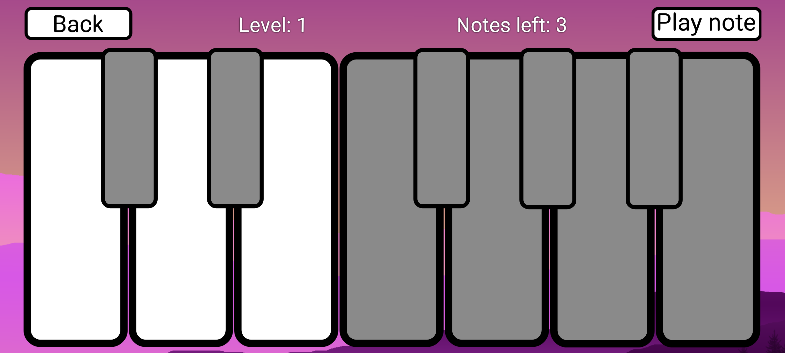
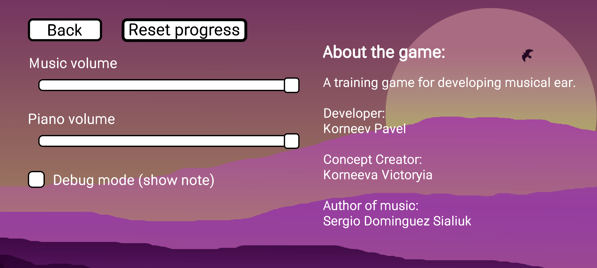
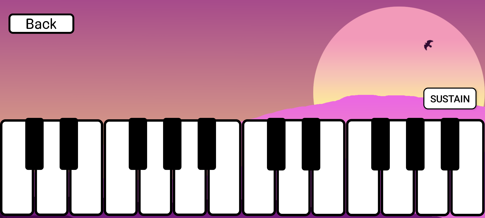

# Note-Voyage

[🇷🇺 Русский](README.ru.md) | 🇺🇸 English

A musical application for learning to play the piano with interactive lessons and training sessions.

## Description

Note-Voyage is an Android application that will help you learn to play the piano. The app includes:

## Screenshots

<div align="center">
  
  <br><br>
  
  
  <br>
  
  
</div>

- **Interactive lessons** - step-by-step learning with visual prompts
- **Training mode** - free play on a virtual piano
- **Sound effects** - realistic piano sounds
- **Learning progress** - tracking your achievements
- **Beautiful interface** - modern design with animations

## Features

### 🎹 Core Features
- Virtual piano with realistic sounds
- Difficulty level system
- Interactive lessons with key highlighting
- Free training mode
- Sound and volume settings

### 🎵 Audio Features
- High-quality piano sounds
- Background music
- Volume control
- Sustain effect (note hold)

### 🎮 Game Elements
- Level progress
- New level unlocking

## Installation

### Requirements
- Android 7.0 (API level 24) or higher
- Minimum 200 MB free space

### Building from Source

1. Clone the repository:
```bash
git clone https://github.com/Grossbeak/Note-Voyage
cd Note-Voyage
```

2. Open the project in Android Studio

3. Sync Gradle dependencies

4. Build the project:
```bash
./gradlew assembleDebug
```

5. Install on device:
```bash
./gradlew installDebug
```

## Usage

### First Launch
1. Launch the application
2. Select "Play" in the main menu
3. Start with the first level

### Navigation
- **Main Menu** - game mode selection
- **Level Selection** - choose a lesson to study
- **Game Screen** - interactive piano
- **Settings** - sound and other parameter settings

### Game Modes
- **Lessons** - structured learning
- **Training** - free play

## Project Structure

```
MyPianoApp/
├── app/
│   ├── src/main/
│   │   ├── java/com/grossbeak/mypianoapp/
│   │   │   ├── MainMenuActivity.java      # Main menu
│   │   │   ├── GameActivity.java          # Game screen
│   │   │   ├── LevelSelectActivity.java   # Level selection
│   │   │   ├── TrainingActivity.java      # Training mode
│   │   │   └── MusicManager.java          # Sound management
│   │   ├── res/
│   │   │   ├── layout/                    # XML layouts
│   │   │   ├── drawable/                  # Graphic resources
│   │   │   ├── values/                    # Strings, colors, styles
│   │   │   └── mipmap/                    # App icons
│   │   └── assets/
│   │       ├── note_sounds/               # Note sounds
│   │       ├── bg_music.mp3               # Background music
│   │       └── piano_keys/                # Key images
│   └── build.gradle.kts                   # Build configuration
├── gradle/
└── build.gradle.kts
```

## Technical Details

### Technologies Used
- **Language**: Java
- **Minimum SDK**: API 24 (Android 7.0)
- **Target SDK**: API 34 (Android 14)
- **Architecture**: Activity-based
- **Audio**: MediaPlayer, SoundPool

### Key Components
- **Activity Lifecycle** - screen lifecycle management
- **Custom Views** - custom interface components
- **Asset Management** - resource management
- **Audio Management** - sound playback system

## Development Setup

### Required Tools
- Android Studio Arctic Fox or newer
- JDK 11 or higher
- Android SDK API 24+

### Environment Variables
```bash
export ANDROID_HOME=/path/to/android/sdk
export JAVA_HOME=/path/to/jdk
```

## License

This project is licensed under [specify license].

## Contact

- **Developer**: GrossBeak
- **Email**: truecapybara@gmail.com
- **GitHub**: [\[profile_link\]](https://github.com/Grossbeak)

## Acknowledgments

Thank you to everyone who helped develop this application!

---

**Version**: 0.8.1 
**Last Updated**: 28.07.2025 